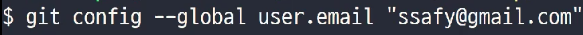
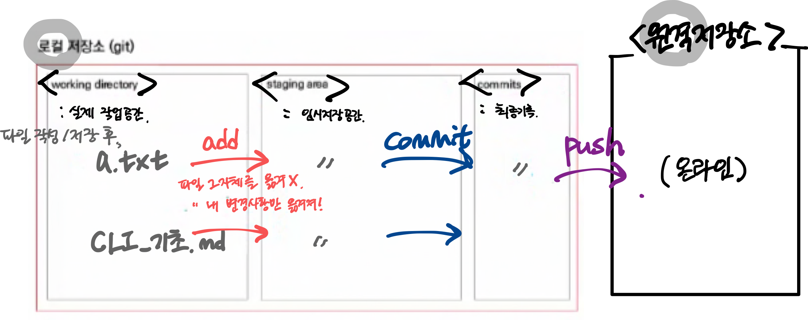

# 경로

* 절대경로

  : 루트 디렉토리로부터 목적 지점까지 거치는 모든 경로를 전부 작성한 것.

  * 루트 디렉토리?
    * 모든 파일과 폴더를 담고 있는 

* 상대경로
  * ./
  * ../

# 터미널 기초 명령어

* touch

  : 파일 생성 명령어

  띄어쓰기로 구분, 여러 파일 한번에 생성 가능

  숨김파일을 만들때 파일명 앞 . 붙이기

* mkdir

  : 폴더 이름 사이에 공백을 넣고 싶다면 따옴표로 묶어 가능

  `mkdir 폴더명`

  `mkdir '서울 1반'`

* ls

* mv

* cp

* cd

  `cd -` , `cd ..`: 바로 이전 디렉토리

* clear

* open (맥)

  : 특정 위치의 폴더를 GUI 형태로 여는 명령어

  * open .

## 유용 단축키

* 위 아래 방향키 : 입력 명령어 히스토리 조회
* tab : 폴더/파일명을 자동 완성시켜줌.

a.txt 파일을 추가적으로 또 수정 후

